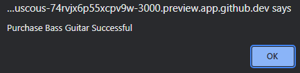

# Practice Problems for Javascript & Python Day 3


In day 3, using the conditional statements, lops and arithmetic learned in the first day. To accelerate the learning process we will jump to using function and getting functions to work in conjunction with a math arithmetic problem. 

The point of this lesson is to understand the different scopes, for this day we will be looking at the global and functions scope to keep things more simple. The other scopes are included within this section if needed, but they will be looked over more in depth. 

Some Review before we get started: 

```
Using if statements

    if (conditional name) {
        
        Insert function within statement 


    }

Using if & else statements 

    if (conditional name) {

        Insert function within statement is if statement is true

    } else {

        Insert function if the if statement is false 
    }

Using if, else if, & else statements 

    if (conditional name) {

        insert function if this if statement is true 

    } else if {

        Insert function if the first if statement above fails or    
        any other "else "if" statements do not work 

    } else {

        insert code for if all else fails 

    }

Loops Review:


    for (intial conditon; condtional expression; counter) {

        ...more statements

    }

    for (key in object) {

        ...more statements
    }

    for (variable of iterable item) {

        ...more statements
    }


    while (conditon) {

        ...more statements

        counter must also be included
    }

Writing Functions in Javascript: 


function function_name([parameters]) {

    // code to be executed 

}

Example of functions: 

    functions Math(x, y) {

        var result = x + y

        return result


    }

    console.log(Math(5,6))


```

## Problem 1

Congratulations! You are a recent software developer for Melodic Tools. For background, Melodic tools makes and sells musical instruments online. You have been hired to make a a very simple website that allows the user to click a button on an instrument that they like and purchase it. 

The website should behave like the following:

User clicks, for example, bass guitar and a alert message pops stating that the purchase has been made and the transaction has been completed. 



**Do not mind test text at the top. As long as your code outputs that the Purchase has been succesful, that is all that counts for this problem**

Feel free to add CSS and more style to this problem there is freedom for all problem but have fun. 