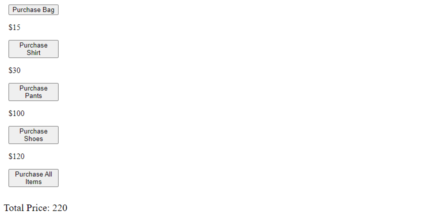

# Problems for Day 5 | DOM Methods 


For this lesson it is required that you research what Objects are. This is because Document Object Model (DOM) is in short, another object within Javascript. It is not a new method or something out of the blue. 

Here is the example syntax for what that might look like 

``` 
Ex 1: 
document.body.innerHTML = 'Hello'
```

Let's break it down

"document" = refers to the whole HTML document. 

".body" = refers to the body tag and everything within the body tag 

"innerHTML" = refers to the HTML within the p tag. 


You can use console.log for each object within the example. If you console.log(document.body) = <p.>Text within p tag</p>. For the ".innerHTML" you are modifying the HTML within the p tag.  
~~~
<html>

    <body>
        <p>Text within p tag</p>
    </body>

</html>
~~~
```
Ex 2:

document.title = "Good Job!";
```

For the example above it modifies the title tag. You can keep adding object to the line to dive deeper within the scope. 

## Review: 

Properties of Document Object: 

**document.title**: Give the document's title tag 

**document.body**: Give the documents body tag & everything in it 

HTML Elements are converted to Javascript Object 

**.innerHTML**: Gives all HTML within the body 

* Within innerhtml, you can replace all the HTML in the webpage 

**document.querySelector()**: lets us get any element from the page and put it inside javascript 

Example: 

~~~
Example:

document.querySelector('button'): Gets first Byttion Element and put it in the page 

* Like the body.innerHTML method, querySelector can do that as well. 

~~~
~~~
Example: 

document.querySelector('button').innerHTML

~~~

You can also look for classes, or tags with a specific class 

~~~
Example: 

<button class="Hey">Hello World</button>

<script>

document.querySelector('.Hey')

</script>

~~~


### Selecting Elements in the DOM:

// getElementById();
~~~
var body = document.getElementById('body');
~~~
// getElementByClassName (): 
~~~
var fav_colors = document.getElementsByClassName('colors');
~~~
// getElementsByTagName ();
~~~
var list_items = document.getElementsByTagName("li");
~~~
//query selector 
~~~
var fav_colors = document.querySelector('.fav_colors');
~~~
// query selector all 


Selects all matching elements 
~~~
var fav_colors = document.querySelector('.fav_colors')
~~~

Styling Elements with Javascript

var body = document.getElementId('body_id');

body.style.color = red 

.style is the css style and .color is the css method red is the modifying element. For example, if written in CSS, the code would look like this: 

~~~
#body_id {
    color: red 

}
~~~

Creating elements 

~~~
Ex 

const ul = document.querySelector('ul');
const li = document.createElement('li');

ul.apend(li)

.append is used to add elements and .createElement is used to create it
~~~

Modify Text: 

**.innerText**

**.textContent**

**.innerHTML**

// Modifying Attributes & Classes 
~~~
li.setAttribute('id', 'main-heading');
  .removeAttribute
~~~
Addin Classes

~~~
.classList.add('class_name');

.classList.remove('class_name');

.classList.contains('class_name);
~~~

## Event Listeners

Syntax: element.addEventListener('click', function);

Example
~~~

const buttonTwo = document.querySelector(' btn-2');

function alertBtn() {

    alert('Javascript');

};

buttonTwo.addEventListener('click', alertBtn)
~~~


In the example above you check if the button is clicked, the javascript text listens for if the button is clicked and does the function next to it which is the alertBtn. 


## Problem 1 


You are in charge of creating a fashion website. Compared to previous designs in these lessons, we will be changing the html directly to show the price that is added to the purchase. Every time a button is clicked, it adds to the price. You will also add a purchase button that will, in theory, place the order and reset the price. 
~~~
Hint: You may need to use the parseInt() function
~~~


## Output: 



When the Purchase all items button is clicked the total price should go to zero. 


